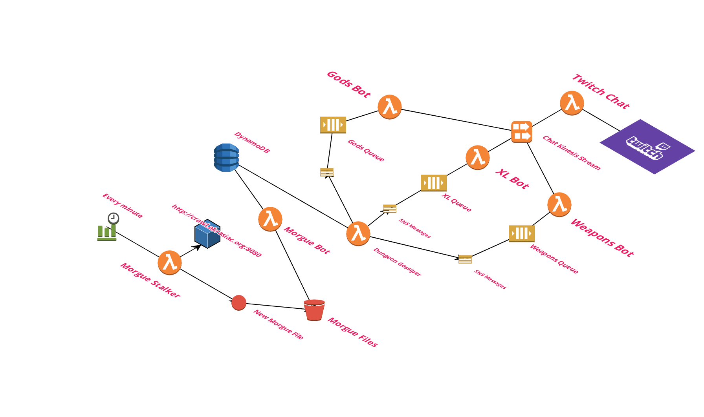

This is a Bot to interact with your local Morgue file, which will let users in Twitch Chat, to ask questions about various aspects of your game:

## Set Up

```bash
export MORGUEBOT_TWITCH_OAUTH_TOKEN="a token from here https://twitchapps.com/tmi/"
export MORGUEBOT_BOT_NAME="the name of your bot"
export MORGUEBOT_CHANNEL="what channel your bot is going to join"
```

Then you can start the bot
```
python bot.py
```

And in chat !h?, should print out the available commands

## Morgue File Finding Options

You can fetch a local Morgue File
parser.add_option("-c", "--char", action="store", type="string", dest="character")

Or You can Fetch a Morgue File online from
f"http://crawl.akrasiac.org/rawdata/{character}/{character}.txt"
```
    parser.add_option("-c", "--char", action="store", type="string", dest="character")
    parser.add_option("-l", "--local", action="store_true", dest="local_mode")
    parser.add_option(
        "-m", "--morgue-file", action="store", type="string", dest="morgue_filepath"
    )
    parser.add_option(
        "-u", "--morgue-url", action="store", type="string", dest="morgue_url"
    )
```

## Bot Mode:

TODO:

## Command Mode

The `-e` flag or `--exec-cmd` will execute a single command you pass it, instead of starting the bot.
```
python bot.py -e rFire
```

You can disable sending bot messages to twitch and output to STDOUT with `-d` or `--disable-twitch`

```
python bot.py -e mutations -d
```

## Deployed Architecture


